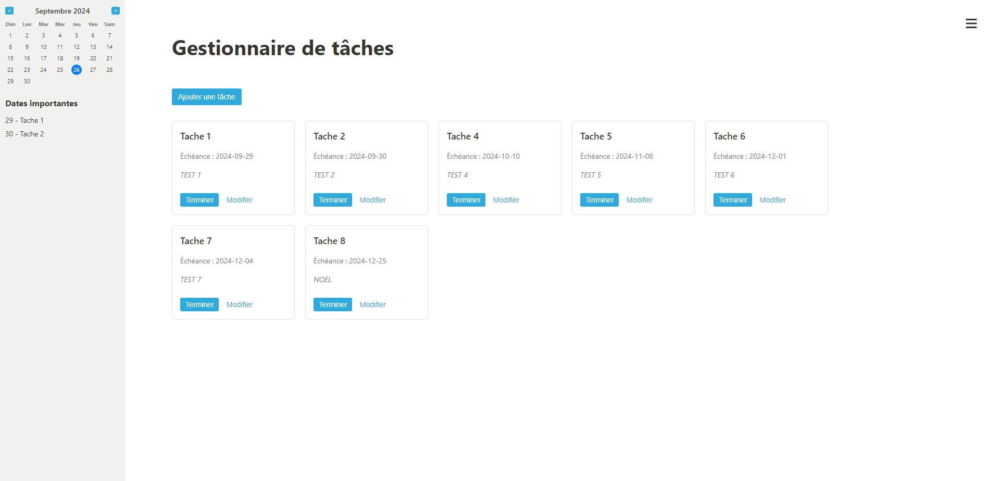

<h1>Gestionnaire de Tâches</h1>
<h3>Cette application permet de gérer des tâches sous forme de tuiles. Voici les principales fonctionnalités :</h3>

- **Ajout de tâches** : Un bouton permet d'ajouter une tâche en ouvrant un formulaire pour entrer un nom (max. 50 caractères) et une date d'échéance. D'autres critères peuvent être ajoutés si nécessaire.
- **Envoi de requêtes asynchrones** : Lors de la création d'une tâche, une requête asynchrone en JSON est envoyée à http://gyoukou.ca/ressources/projet3.php, puis une nouvelle tuile est affichée.
- **Gestion des tâches** :
  - Chaque tâche affiche son titre, sa date d'échéance et un bouton/case à cocher pour la terminer. Lorsqu'une tâche est terminée, elle disparaît de l'affichage, et une requête GET asynchrone est envoyée au serveur. Un message d'alerte est affiché avec la réponse du serveur.
  - Un bouton permet également de modifier la tâche (nom et/ou date d'échéance), avec envoi des modifications au serveur via une requête asynchrone.

